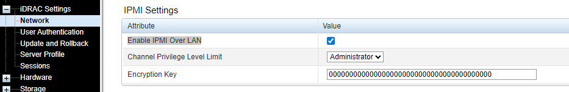

# Dell iDRAC Fan Control Script - PowerShell 
## 基于戴尔ipmi工具的服务器风扇调速Powershell脚本

## Contents
- [Dell iDRAC Fan Control Script - PowerShell](#dell-idrac-fan-control-script---powershell)
  - [基于戴尔ipmi工具的服务器风扇调速Powershell脚本](#基于戴尔ipmi工具的服务器风扇调速powershell脚本)
  - [Contents](#contents)
  - [What This Script Does](#what-this-script-does)
  - [Preparations Before Use](#preparations-before-use)
    - [Enable IPMI Management on the Target Server](#enable-ipmi-management-on-the-target-server)
    - [Verify Dell IPMI Management Tools Are Installed on the Management Machine](#verify-dell-ipmi-management-tools-are-installed-on-the-management-machine)
  - [Usage Instructions](#usage-instructions)
  - [Frequently Asked Questions](#frequently-asked-questions)
    - [1. I cannot locate my `ipmitools` directory](#1-i-cannot-locate-my-ipmitools-directory)
    - [2. My PowerShell cannot run this script, showing “Script execution is disabled on this system”](#2-my-powershell-cannot-run-this-script-showing-script-execution-is-disabled-on-this-system)
  - [目录](#目录)
  - [这个脚本会做到](#这个脚本会做到)
  - [使用前的准备工作](#使用前的准备工作)
    - [开启受控服务器的IPMI管理功能](#开启受控服务器的ipmi管理功能)
    - [确认管理端安装了Dell ipmi管理工具](#确认管理端安装了dell-ipmi管理工具)
  - [使用方法](#使用方法)
  - [常见问题](#常见问题)
    - [1. 我找不到我的ipmitools目录](#1-我找不到我的ipmitools目录)
    - [2. 我的PowerShell无法运行此脚本，提示“因为在此系统上禁止运行脚本”](#2-我的powershell无法运行此脚本提示因为在此系统上禁止运行脚本)

## What This Script Does
Automatically navigates to the C:\Program Files\Dell\SysMgt\iDRACTools\IPMI directory.
Prompts the user to enter the server IP, username, and password.
Allows the user to select fan mode (Manual/Auto).
If Manual is chosen, prompts for the RPM percentage (1–100), converts it to hexadecimal, and executes the corresponding command.
If Auto is selected, it directly executes the automatic fan command.
The script runs in a loop until the user inputs exit to quit.
It remembers the last entered IP/username. Pressing Enter in the next loop will reuse these values, though the password must be re-entered (for security reasons, passwords are not cached).

## Preparations Before Use
### Enable IPMI Management on the Target Server
Before use, log into the target server's iDRAC. Navigate to Overview -> iDRAC Settings -> Network -> IPMI Settings. Check “Enable IPMI Over LAN” and ensure the account has administrative privileges. 
### Verify Dell IPMI Management Tools Are Installed on the Management Machine
If the management software is not yet installed on your computer, visit [DELL Support](https://dl.dell.com/FOLDER08952901M/1/Dell-iDRACTools-Web-WINX64-11.0.0.0-5139_A00.exe) to download the program directly.

## Usage Instructions

Download this project's source code, save the script as `fan_control.ps1`, and ensure PowerShell is launched as an administrator before running. Execute the script by entering the command: `./fan_control.ps1`
Then follow the script prompts to input the corresponding information and easily adjust your server fans.

## Frequently Asked Questions
### 1. I cannot locate my `ipmitools` directory
- Ensure you downloaded the IPMI tools directly from Dell and did not change the installation path. The default location is `C:\Program Files\Dell\SysMgt\iDRACTools\IPMI`. If this is not the case, verify your IPMI tool installation path and modify the incorrect path in the script to the correct one.
### 2. My PowerShell cannot run this script, showing “Script execution is disabled on this system”
- PowerShell's security policy flags this script as unsafe and blocks execution. Simply grant permissions by running PowerShell with administrator privileges and entering the command `set-ExecutionPolicy RemoteSigned` to modify the policy.

## 目录
  - [基于戴尔ipmi工具的服务器风扇调速Powershell脚本](#目录)
  - [这个脚本会做到](#这个脚本会做到)
  - [使用前的准备工作](#使用前的准备工作)
    - [开启受控服务器的IPMI管理功能](#开启受控服务器的ipmi管理功能)
    - [确认管理端安装了Dell ipmi管理工具](#确认管理端安装了dell-ipmi管理工具)
  - [使用方法](#使用方法)
  - [常见问题](#常见问题)
    - [1. 我找不到我的ipmitools目录](#1-我找不到我的ipmitools目录)
    - [2. 我的PowerShell无法运行此脚本，提示“因为在此系统上禁止运行脚本”](#2-我的powershell无法运行此脚本提示因为在此系统上禁止运行脚本)

## 这个脚本会做到
自动进入 C:\Program Files\Dell\SysMgt\iDRACTools\IPMI 目录。
让用户输入服务器 IP、用户名、密码。
让用户选择风扇模式（手动/自动）。
如果选择手动，就再输入转速百分比（1–100），自动转换成十六进制，并执行相应命令。
如果选择自动，就直接执行自动风扇命令。
脚本在循环里运行，直到用户输入 exit 才退出。
记住上一次输入的 IP / 用户名，下次循环时直接按 Enter 就会沿用之前的值且密码依然需要重新输入（出于安全考虑，不缓存密码）。

## 使用前的准备工作
### 开启受控服务器的IPMI管理功能
使用前请登录受控服务器的iDRAC，进入Overview->iDRAC Settings->Network->IPMI Settings，勾选Enable IPMI Over LAN且确认账户具有管理权限。
### 确认管理端安装了Dell ipmi管理工具
如果电脑上还没有安装管理软件，则请访问[DELL Support](https://dl.dell.com/FOLDER08952901M/1/Dell-iDRACTools-Web-WINX64-11.0.0.0-5139_A00.exe)直接获取程序。

## 使用方法

下载本项目源码，保存脚本为fan_control.ps1，运行时请确保以管理员身份启动 PowerShell。然后运行脚本，输入命令./fan_control.ps1
然后根据脚本提示，输入对应的信息即可轻松调整服务器风扇。

## 常见问题
### 1. 我找不到我的ipmitools目录
- 确保你是从戴尔官方下载的ipmitool工具且没有更改安装路径，默认位于 
  `C:\Program Files\Dell\SysMgt\iDRACTools\IPMI`，如果不是请检查你的ipmi工具安装路径且在脚本中将错误的路径更改为正确的路径。
### 2. 我的PowerShell无法运行此脚本，提示“因为在此系统上禁止运行脚本”
- Powershell的安全策略将此脚本视为了不安全脚本，不允许执行。只需要放开权限就行。我们通过管理员权限运行PowerShell，然后输入命令`set-ExecutionPolicy RemoteSigned`修改策略即可。
